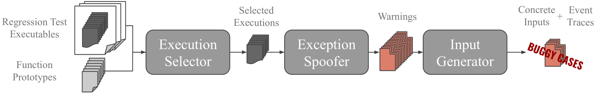
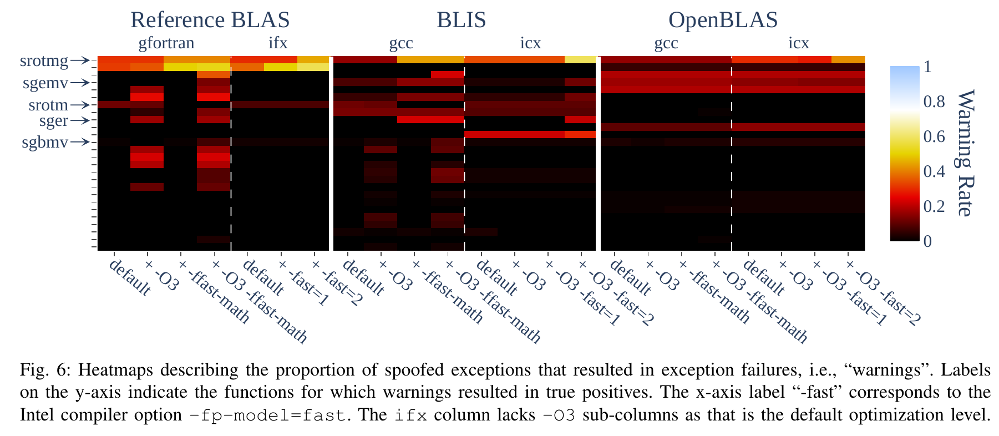
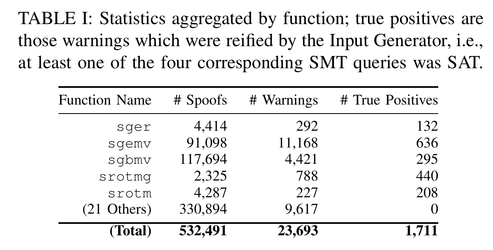

# EXCVATE: Exceptional Value Testing
### This is the artifact accompanying the 2025 ARITH publication, "EXCVATE: Spoofing Exceptions and Solving Constraints to Test Exception Handling in Numerical Libraries"



From the paper:
> Numerical software is ubiquitous. It is therefore important to ensure its
correctness. High-profile failures of mission-critical numerical software
emphasize this importance
\[[1](https://epubs.siam.org/doi/pdf/10.1137/1.9781611975567.bm)\], but
designing algorithms to be error-free over all possible inputs is difficult and
leads to programs that waste time pre-emptively checking for special cases that
are uncommon in
practice \[[2](https://dl.acm.org/doi/10.1145/227699.227701),[3](https://ieeexplore.ieee.org/document/295860)\].
In light of this, the IEEE 754 Standard defines five floating-point (FP)
exceptions \[[4](https://standards.ieee.org/ieee/754/6210/)\]. The correctness of numerical software is therefore
contingent upon responding to these exceptions in a predictable and consistent
way, i.e., __Exception Handling__. Because the correctness of such software is
built upon the correctness of its building blocks, it is of the utmost
importance to ensure the soundness of the exception-handling strategies
implemented by numerical libraries.
> 
> Three of the five exceptions generate an __Exceptional Value__ (EV): either
`+/-Inf` or `NaN`. Furthermore, the standard explicitly defines most operations
on `Inf` and `NaN` operands to support propagation, thus presenting an attractive
definition for a sound exception-handling policy:
> 
> __Definition 1.__ _When an Overflow, Divide-by-Zero, or Invalid exception occurs, a
**sound exception-handling policy** notifies users by either (1) the
presence of EVs in the output, or by (2) some
library-specific reporting mechanism triggered by checking for their
presence at some point during the execution._
> 
> This is the definition adopted by the reference implementations for the
widely-used LAPACK and BLAS numerical
libraries \[[5](https://ieeexplore.ieee.org/document/10027518)\] and is the one we
consider in this work. Testing exception handling can then be framed as an input
generation problem: how can we find inputs that cause exceptions for
which the policy described in
Definition 1 is violated?

__EXCVATE is a proof-of-concept implementation of a novel approach to addressing this input generation problem: using binary instrumentation, EXCVATE tests exception handling in numerical libraries using both low-cost exception spoofing and powerful constraint solving applied to existing library test binaries. For a full description of the approach, please refer to the paper.__

## Table of Contents
__[0]__ _Build/Install_

__[1]__ _Tutorial_

------------__[1.1]__ _Preliminaries_

------------------------__[1.1.1]__ _Setting Up The Environment_

------------------------__[1.1.2]__ _Inspecting The Targets_

------------------------__[1.1.3]__ _Running The Test Executable_

------------__[1.2]__ _Use EXCVATE to test the_ `gfortran` _Test Executable_

------------------------__[1.2.1]__ _The Prototype Files_

------------------------__[1.2.2]__ _Running the Execution Selector_

------------------------__[1.2.3]__ _Running the Exception Spoofer_

------------------------__[1.2.4]__ _Running the Input Generator_

------------------------__[1.2.5]__ _Inspecting the Results_

------------------------__[1.2.6]__ _Conclusion_

------------__[1.3]__ _Use EXCVATE to test the_ `ifx` _Test Executable_

__[2]__ _Reproducing Results from the 2025 ARITH Publication_

------------__[2.1]__ _Experiment Description_

------------__[2.2]__ _Generating the Results_

------------__[2.3]__ _Inspecting the Results_

------------------------__[2.3.1]__ `equivalence_classes.txt`

------------------------__[2.3.2]__ `figure_6.html`

------------------------__[2.3.3]__ `table_1_data.txt`

------------------------__[2.3.4]__ `out.txt` _and_ `nohup.out`

------------------------__[2.3.5]__ `{FUNCTION_SYMBOL_NAME}.io_vars`

------------------------__[2.3.6]__ `{FUNCTION_SYMBOL}.{HASH1}.{HASH2}.*`

------------__[2.4]__ _Examples That Support the Findings Described in the Paper_

------------------------__[2.4.1]__ `srotmg`

------------------------__[2.4.2]__ `srotm`

------------------------__[2.4.3]__ `sgbmv`

------------------------__[2.4.4]__ `sger`

------------------------__[2.4.5]__ `sgemv`

------------__[2.5]__ _Reproducing the Symbolic Execution Motivating Example_

------------__[2.6]__ _Errata_

__[3]__ _Known Limitations_


## __[0]__ Build/Install

__All commands in this section are run from the root of this repo.__

Either acquire the pre-built docker image:
```
docker pull ucdavisplse/excvate:artifact
```

...or build the image yourself:
```
docker build scripts/install -t ucdavisplse/excvate:artifact
```

Once you have the image, run the following _single command_ (~16 minutes): 
```
./scripts/start_docker_container.sh ./scripts/install/install_all.sh
```

## __[1]__ Tutorial

In this tutorial, we will see:
1. How to use EXCVATE to test the exception handling of a simple program
2. An interesting case of an exception-handling failure stemming from the idiosyncratic behavior of the x86 `maxss` instruction
3. How the opaque nature of different compiler transformations can have surprising and unintended consequences for exception handling in floating-point programs

### __[1.1]__ Preliminaries

#### __[1.1.1]__ Setting Up The Environment
From the root of the repo, spin up an interactive docker container by executing:
```
./scripts/start_docker_container.sh
```

Navigate to the `tutorial` directory and reset the workspace:
```
cd tutorial
make reset
```

#### __[1.1.2]__ Inspecting The Targets
The two functions we will target for testing with EXCVATE can be found in `squared_hinge_losses.f90`:

```
module squared_hinge_losses
    implicit none

    contains

        real function squared_hinge_loss1(x)
            real :: x
            squared_hinge_loss1 = (max(0.0, 1-x))**2
        end function

        real function squared_hinge_loss2(x)
            real :: x
            squared_hinge_loss2 = (max(1-x, 0.0))**2
        end function

end module
```

Both of these functions calculate a squared hinge loss with the only difference being in the order of the operands for the `max` intrinsic function; their results should be identical.

#### __[1.1.3]__ Running The Test Executable
Compile a basic test binary of the two functions using `gfortran`:
```
FC=gfortran make
```

And execute the resulting test binary:
```
./test
```

All looks good here: our computed values match our expected values and the output of `squared_hinge_loss1` matches the output of `squared_hinge_loss2`.

### __[1.2]__ Use EXCVATE to test the `gfortran` Test Executable

Be sure the experiment repo is fresh and that you have a test executable generated by `gfortran`:
```
make reset
FC=gfortran make
```

#### __[1.2.1]__ The Prototype Files
Referencing the overview of the EXCVATE workflow at the top of this README, note that we have one of the two inputs: the test executable. Now, let us discuss the prototype files. First, find the symbols in the test excutable corresponding to the functions we will be testing.
```
nm ./test | grep -e "squared_hinge_loss1" -e "squared_hinge_loss2"
```

Note how these symbol names correspond to the names of the prototype files in `prototypes/gfortran`. The contents of each of these prototype files is identical:
```
x       r   32  in      1
result  r   32  return  1
```
This indicates to EXCVATE that there is a single 32-bit real input we are naming `x` and a single 32-bit real return value we are naming `result`. (For a more elaborate example of a function prototype and the syntax supported in such files, see `artifact/blas_prototypes_single_precision_level12/sgemv_.prototype` and others BLAS prototypes in that directory.)

#### __[1.2.2]__ Running the Execution Selector

Let us run the first component of EXCVATE to automatically select a representative subset of function executions from the test executable:
```
execution_selector -f prototypes/gfortran/ -- ./test
```
We see the stdout from the normal execution of the `test` executable followed by some summary statistics from EXCVATE:

```
    saved 1 __squared_hinge_losses_MOD_squared_hinge_loss2 executions for replay
    saved 1 __squared_hinge_losses_MOD_squared_hinge_loss1 executions for replay
    saved 2/8 executions for replay
```

Note that we saved 1 execution for each of the functions under test. This is because there is no control flow in either of these functions so a single execution using one of the test inputs suffices for each in order to cover all executable paths.

#### __[1.2.3]__ Running the Exception Spoofer 
Now that the first component has selected a representative subset of function executions, let us run the second component of EXCVATE. This will (1) replay the selected function executions while automatically spoofing exceptions at all executed instructions that would generate a `NaN` if they were to trigger an "Invalid" exception, and (2) check whether or not the spoofed exception is handled according to the exception-handling policy stated in the paper excerpt at the beginning of this README.
```
exception_spoofer -f prototypes/gfortran/ -- ./test
```
You should see the following stdout:
```
** replaying function executions with nan overwrites
    __squared_hinge_losses_MOD_squared_hinge_loss2
               Spoofed Exceptions: 2
      Exception-Handling Failures: 0
                     Failure Rate: 0.0000%
                       Miss Count: 0
    __squared_hinge_losses_MOD_squared_hinge_loss1
               Spoofed Exceptions: 2
      Exception-Handling Failures: 1
                     Failure Rate: 50.0000%
                       Miss Count: 0
```
The Spoofed Exception count for each is 2 because there are two possible instructions executed that could cause an "Invalid" exception: the subtraction and a multiplication. It looks like the Exception Spoofer found a potential exception-handling failure in `squared_hinge_loss1`.

#### __[1.2.4]__ Running the Input Generator
Because the Exception Spoofer has issued a warning about a potential exception-handling failure in `squared_hinge_loss1`, let us run the third component of EXCVATE to investigate further. The Input Generator will try to construct an input to `squared_hinge_loss1` that will reify the spoofed exception that resulted in an exception-handling failure. It will do so by (1) generating and trying to satisfy four SMT queries per warning (see paper for more details on these queries), (2) for any satisfying assignments (i.e., function inputs) found, running the function on that input to generate an event trace of executed instructions that contained exceptional values.
```
input_generator -f prototypes/gfortran/ -- ./test 
```
You should see the following stdout:
```
** attempting to generate inputs that reify exception-handling failures
    __squared_hinge_losses_MOD_squared_hinge_loss1
        2 SAT instances
        2 event traces generated
```

#### __[1.2.5]__ Inspecting the Results
Let us look at the contents of one of the event traces:
```
cat __EXCVATE/__squared_hinge_losses_MOD_squared_hinge_loss1/__squared_hinge_losses_MOD_squared_hinge_loss1.0.10925258426844263976.smt2.out1.event_trace
```

You should see the following (omitting a few columns for display purposes):
```
(in) x: nan 
(out) result: 0

====================================

Disassembly                   Event   Taint Count    
movss xmm2, dword ptr [rax]   G---    1              
subss xmm0, xmm2              -P-r    2              
maxss xmm0, xmm1              --Kr    1            
```

At the top, we see the inputs generated by the SMT solver and the output returned by the function; a NaN input is resulting in a zero output! To shed some light on what happened, we can inspect the event trace at the bottom which lists all executed instructions where exceptional values were found:
1. First, the `movss` instruction loaded the input NaN from memory into the `xmm2` register. The `G---` event code indicates that this was a "**G**enerate" event as this was the first instruction to see the NaN.
2. The `subss` instruction performed the subtraction `1-x` and stored the result into `xmm0`. The `-P-r` event code indicates that there was both a "**r**ead" event (there was an exceptional value in one of the read operands) and a "**P**ropagate" event. The taint count indicates that after that instruction, EXCVATE was tracking two exceptional values: one in `xmm2` and the other in `xmm0`.
3. The `maxss` instruction performed the max operation. The `--Kr` event code indicates that there was both a "**r**ead" event and a "**K**ill" event which overwrote the NaN in `xmm0` that was written there by the previous `subss` instruction. The decremented taint count reflects this.

This concludes the executed instructions that had exceptional values. While the non-zero taint count in the last row of the event trace highlights the fact there is still one `NaN` in the `xmm2` register, the x86 calling convention dictates that floating-point function return values are passed in `xmm0`; thus, we can deduce that the 0 return value was written by the `maxss` instruction and no further instructions read from the `xmm2` register.

#### __[1.2.6]__ Conclusion

[From the documentation of the `maxss` instruction](https://www.felixcloutier.com/x86/maxss):
> __If only one value is a NaN (SNaN or QNaN) for this instruction, the second source operand, either a NaN or a valid floating-point value, is written to the result.__ If instead of this behavior, it is required that the NaN from either source operand be returned, the action of MAXSS can be emulated using a sequence of instructions, such as, a comparison followed by AND, ANDN, and OR.

While this default behavior is questionably correct (it does not adhere to the definition of `maximum` provided in the [IEEE-754 2019 standard](https://standards.ieee.org/ieee/754/6210/) which mandates propagation in the case of any quiet `NaN` operands), this could be forgiven if either `gfortran` translated the Fortran `max` intrinsic into the IEEE-compliant sequence of instructions alluded to by the documentation (it does not), or at the very least if `gfortran` generated a `maxss` instruction whose operand order was consistent with what was written in the source code...

However, if the latter were true, we would expect `squared_hinge_loss2` to have the exception-handling failure found by EXCVATE and not `squared_hinge_loss1`. To see this, let's consider `squared_hinge_loss1` for which the `max` operation in the source code has the subtraction as the second operand. Since the subtraction operation is the only potential source for a `NaN`, we could assume from the `maxss` documentation that writing the source in this way ensures propagation. But we saw that the assembly generated by `gfortran` actually places the result of the subtraction (`subss xmm0, xmm2`) as the _first_ operand to the max instruction (`maxss xmm0, xmm1`). The compiler reversed the order of the operands! Hence, `squared_hinge_loss1` has an unexpected exception-handling failure.

Furthermore, since EXCVATE did not find a failure in `squared_hinge_loss2`, we can deduce that the operand reversal in the translation to assembly happenend there as well, thus leading to an order of `maxss` operands that actually ensured propagation. Interesting!

### __[1.3]__ Use EXCVATE to test the `ifx` Test Executable

Go back to __[1.2]__ and follow the same steps, substituting `ifx` for `gfortran` throughout. What changes?

_Spoiler: both functions now have the exception handling failure._ It seems that `ifx` is determined to set the operand order so that, as written, there will always be an exception-handling failure in the code...

## __[2]__ Reproducing Results from the 2025 ARITH Publication

### __[2.1]__ Experiment Description
From the paper:
> We target the BLAS (Basic Linear Algebra Subprograms). The BLAS are a
> specification of low-level routines for common linear algebra operations and
> are the de facto standard for such routines. Here, we consider
> single-precision versions of the Level 1 and Level 2 BLAS which perform vector
> and matrix-vector operations respectively. We omit functions which do not
> perform any exception-prone operations `sswap`, `scopy`) and those which do
> not return any FP output or make any error-handling related calls (`isamax`).
> This leaves 26 functions. We test the implementations of these 26 functions
> provided by the reference BLAS (v1.12) as well as two high-performance
> implementations: BLIS (v1.0), and OpenBLAS (v0.3.28). These versions are the
> current releases at the time of writing. We test each library across both GNU
> (`gfortran`/`gcc` v11.4.0) and Intel compilers
> (`ifx`/`icx` v2024.2.0) as well as multiple optimization levels.
> This makes for a cross product of 598 (function, library, compiler,
> optimization level) tuples.

### __[2.2]__ Generating the Results

Execute the following _single command_ from the root of this repo (and __not__ inside of an already-running docker container) to run the experiments reported in the paper and to reproduce the results. This will occur in the background and should take about 12 hours.
```
nohup ./scripts/start_docker_container.sh ./artifact/execute.sh &
```

### __[2.3]__ Inspecting the Results

At the conclusion of testing, the results will be saved in the following directory structure
```
artifact/
├── results
.   ├── equivalence_classes.txt ............[2.3.1]
.   ├── figure_6.html ......................[2.3.2]
.   ├── table_1_data.txt ...................[2.3.3]
.   ├── {BLAS_IMPLEMENTATION}/
.   .  ├── out.txt ...................................[2.3.4]
.   .  ├── __EXCVATE_{COMPILER}_{OPTIMIZATIONS}/
.   .  .  ├── nohup.out ..............................[2.3.4]
.   .  .  ├── {FUNCTION_SYMBOL}/
.   .  .  .  ├── {FUNCTION_SYMBOL}.io_vars ......................[2.3.5]
.   .  .  .  ├── {FUNCTION_SYMBOL}.{HASH1}.{HASH2}.out ......................[2.3.6]
.   .  .  .  ├── {FUNCTION_SYMBOL}.{HASH1}.{HASH2}.smt2.in{#} ...............[2.3.6]
.   .  .  .  ├── {FUNCTION_SYMBOL}.{HASH1}.{HASH2}.smt2.out{#} ..............[2.3.6]
.   .  .  .  ├── {FUNCTION_SYMBOL}.{HASH1}.{HASH2}.smt2.out{#}.event_trace ..[2.3.6]
.   .  .  .  .
.   .  .  .  .
.   .  .  .  .
```

#### __[2.3.1]__ `equivalence_classes.txt`
From the paper:
> We perform a reduction to equivalence classes based on the assumption that exception-handling failures resulting from exception in the same source code line are indicative of the same buggy behavior. This yields 23 classes...

The code for this reduction is in `scripts/reduce.py`. Please note the minor errata described in [2.6].

#### __[2.3.2]__ `figure_6.html`


This file is an interactive HTML version of the above heatmap from the paper. Hovertext for each cell describes the tuple and its warning rate. A couple of things of note:

1. The low warning rate across the majority of tuples, thus leading us to deduce that most exceptions are handled correctly
2. The relatively high warning rate for `snrm2` tuples (second row) which ends up corresponding to zero reified exceptions from the Input Generator. This means that while a relatively high number of spoofed exceptions resulted in exception-handling failures, the Input Generator determined that none of these exceptions were possible.
3. The relatively high warning rate for `srotmg` tuples which ends up corresponding to many reified exceptions from the Input Generator.
4. The relatively low warning rate for `sgbmv` tuples (0-0.07) which nonetheless ends up corresponding to a many reified exceptions from the Input Generator.

#### __[2.3.3]__ `table_1_data.txt`


This file contains the data that populates the above table from the paper. Please note the minor errata described in [2.6].

#### __[2.3.4]__ `out.txt` and `nohup.out`

Each `nohup.out` contains the terminal output from running EXCVATE on all the functions associated with the `{BLAS_IMPLEMENTATION}`,`{COMPILER}`, and `{OPTIMIZATIONS}` indicated by the containing directories. `out.txt` aggregates all of these into a single text file per `{BLAS_IMPLEMENTATION}`.

#### __[2.3.5]__ `{FUNCTION_SYMBOL}.io_vars`
`{FUNCTION_SYMBOL}.io_vars` is generated by the Execution Selector; it contains the bytes required to replay the selected executions of the (`{FUNCTION_SYMBOL}`, `{BLAS_IMPLEMENTATION}`,`{COMPILER}`,`{OPTIMIZATIONS}`) tuple indicated by the containing directories and is used by the Exception Spoofer and Input Generator.

#### __[2.3.6]__ `{FUNCTION_SYMBOL}.{HASH1}.{HASH2}.*`

Files with names of the form `{FUNCTION_SYMBOL}.{HASH1}.{HASH2}.*` are generated by the Exception Spoofer or the Input Generator. `{HASH1}` uniquely identifies the selected function execution, `{HASH2}` uniquely identifies the site of the exception, and `{#}` distinguishes between the four different kinds of SMT queries generated for each warning (using the notation from the paper, 1 -> $q_1$, 2 -> $\hat{q_1}$, 3 -> $q_2$, 4 -> $\hat{q_2}$; see the paper for descriptions of these queries). 

In the order of their appearance during the EXCVATE workflow:
- `{FUNCTION_SYMBOL}.{HASH1}.{HASH2}.out` is generated by the Exception Spoofer; it shows the inputs to the function used in the regression test, the site of the spoofed "Invalid" exception, and the resulting output.
- `{FUNCTION_SYMBOL}.{HASH1}.{HASH2}.smt2.in{#}` is generated by the Input Generator; it shows the SMT query used to generate the inputs that trigger the exception-handling failure.  
- `{FUNCTION_SYMBOL}.{HASH1}.{HASH2}.smt2.out{#}` is generated by the Input Generator; it shows the satisfying assignment found by the SMT solver for the corresponding query.
- `{FUNCTION_SYMBOL}.{HASH1}.{HASH2}.smt2.out{#}.event_trace` is generated by the Input Generator; it shows the inputs generated by the SMT solver, the output returned by the function, and an event trace listing lists all executed instructions where exceptional values were found. See __[1.2.5]__ for an example.

__Note:__ files associated with tests that ultimately _do not_ result in a reified exception-handling failure are removed. In other words, if the `event_trace` file is not ultimately generated (either because the spoofed exception didn't result in a warning, because none of the SMT queries were SAT, or because the satisfying assignment did not actually reify the exception-handling failure), then any associated files generated previously are deleted.

### __[2.4]__ Examples That Support the Findings Described in the Paper

Specific examples are given for each BLAS function in which EXCVATE found exception-handling failures in order to support the findings described in the paper.

#### __[2.4.1]__ `srotmg`

Run the following command from the root of the repo to dump the contents of a particular event trace file for an interesting exception-handling failure EXCVATE found in the BLIS implementation of `srotmg`:
```
cat artifact/results/blis/__EXCVATE_icx_-O3_-fp-model-fast-2/srotmg_/srotmg_.10281244792018970323.2703141966557069393.smt2.out1.event_trace
```

An excerpt of the terminal output should be:
```
(in) SD1: inf 
(in) SD2: 9.62964e-35 
(in) SX1: -6.49038e+32 
(in) SY1: 1.52588e-05 
(in) SPARAM: 0 0 0 0 0 
(out) SD1: 0 
(out) SD2: 0 
(out) SX1: 0 
(out) SPARAM: -1 0 0 0 0 
```
Along with the rest of the terminal output (ommitted here for brevity), we see that an input `Inf` value precipitates a number of mid-execution exceptions that propagate EVs, none of which find their way to the output. It turns out, this is just a case of poor documentation: while it is not indicated in any of the existing BLAS documentation, [this paper](https://dl.acm.org/doi/10.1145/974781.974786) on the implementation has a single sentence on page six mentioning that setting the last four elements of `SPARAM` to zero indicates an error condition.

Where things get interesting is when we migrate this test input from this particular build of BLIS to _any other test tuple_. An infinite loop results in all cases. This includes the default builds of all three libraries.

#### __[2.4.2]__ `srotm`
See any of the `srotm` event traces for any of the BLIS builds using `icx`. They all fall into the same equivalence class and are all indicative of the same exception-handling failure: that of not checking the first value of the `SPARAM` input array for EVs. While domain knowledge would dictate that it is unreasonable that such values could be provided as input, it would not hurt for documentation to be modified to reflect this.

#### __[2.4.3]__ `sgbmv`

See any of the `sgbmv` event traces for any of the reference BLAS builds. They all fall into the same equivalence class and are all indicative of the same exception-handling failure: implicit zeroes in the banded storage format of the input matrix leading to skipped multiplication operations which, in a naive implementation, would ensure the propagation of input EVs in __x__.

#### __[2.4.4]__ `sger`

See any of the `sger` event traces in the BLIS builds that use `-ffast-math` or `-fp-model=fast=2`. They all fall into the same equivalence class and are all indicative of the same exception-handling failure that stems from the changing behavior of comparison predicates across compiler optimizations in the face of `NaN` inputs.

#### __[2.4.5]__ `sgemv`

See any of the `sgemv` event traces in the BLIS builds that use `-ffast-math` or `-fp-model=fast=2`. They all fall into the same equivalence class and are all indicative of the same exception-handling failure that stems from the changing behavior of comparison predicates across compiler optimizations in the face of `NaN` inputs.

### __[2.5]__ Reproducing the Symbolic Execution Motivating Example

Running the symbolic execution experiment described in the motivating example requires [FPGen](https://github.com/ucd-plse/FPGen/) and its docker image. Run the following command from the root of this repo to acquire these dependencies.
```
./artifact/motivating_example/install_FPGen.sh
```

To run symbolic execution and test the resulting inputs as described in the motivating example, run this _single command_ from the root of this repo (~4 hours in the background):
```
nohup ./artifact/motivating_example/start_klee_docker_container.sh /home/fptesting/EXCVATE_motivating_example/run.sh &
```

To follow the execution as it progresses, you can run `tail -f nohup.out`. At the conclusion of testing, the summarized results will be found at the end of `nohup.out`. They should look something like:

```
============= sgbmv Symbolic Execution Results
29967/46249 exception-causing inputs
691/46249 exception-handling failures
==============================================
```
...indicating that only about 1.5% of the generated inputs revealed exception-handling failures.

### __[2.6]__ Errata

Commit `9ea08f4` introduces a fix that addresses some spurious exception-handling failures reported for `srotmg` in the ARITH paper. Such cases arose due to compiler-generated `divps` instructions which were "half-full", i.e., only two of the four single-precision floating-point divisions yielded results used by the program and the other two yielded NaNs (that then go unused) irregardless of the chosen function input. The Input Generator erroneously identified these two NaN-generating "dummy" divisions as using symbolic operands and so proceeded to generate inputs that trivally reified the exception-handling "failure". The issue stemmed from an uninitialized flag that the fix now correctly initializes. As a result, the third column of the `srotmg` row in Table 1 reduces from 440 to ~250 and the equivalence classes are reduced by half. Other paper results are unaffected.

## __[3]__ Known Limitations
There is no theoretical reason the following could not be supported in EXCVATE. The limiting factor is my time.
- Only supports x86 ISAs <= AVX, and then only the subset of instructions used in the Level 1 and 2 BLAS and the BLIS and OpenBLAS implementations thereof. AVX2 should work but is untested.
- Only supports function arguments of type `char *`, `int_32t *`, `float *`, `double *`. Note that pass-by-reference is the default for Fortran and because the reference BLAS are written in Fortran, the BLIS and OpenBLAS implementations provide the same interface.
- No multithreading